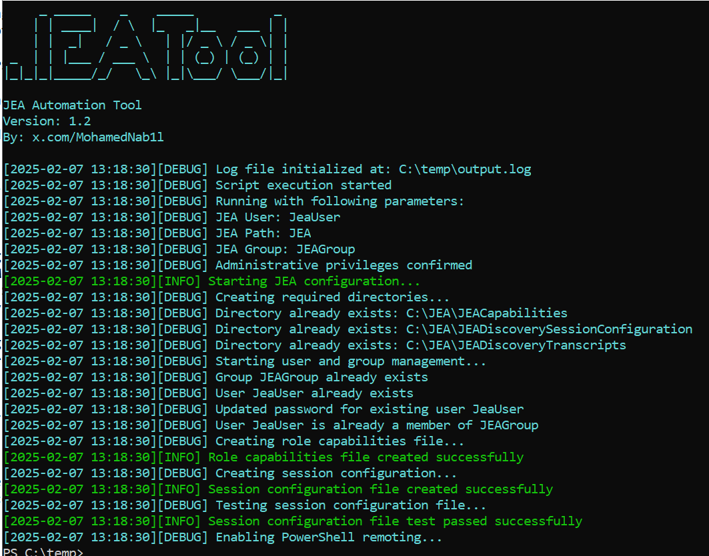

# JEA Tool- Automated JEA Configuration Tool



A PowerShell script to configure Just Enough Administration (JEA) for automation tools like Ansible, BMC Discovery, and other remote management systems that needs admin rights permissions. The script will autoamte JEA configuration to comply with enterprise security policies while enabling remote access for automation.

## Overview
- Creates secure JEA endpoints for automation tools
- Configures restricted users/groups for JEA permissions
- Generates session transcripts and logs
- Supports Windows Server 2016+/Windows 10+ with PowerShell 5.1+

## Prerequisites
1. **Run as Administrator**: Required for system changes
2. **PowerShell Execution Policy**: Set to `RemoteSigned` or `Unrestricted`
   ```powershell
   Set-ExecutionPolicy RemoteSigned
   ```
3. **PSRemoting Enabled**: (Script enables this automatically if missing)

---

## Installation & Usage

### 1. Download the Script
```bash
wget https://github.com/bigb0x/JEA-Tool.git
```

### 2. Customization (Pre-Run)
Edit these variables in the script for your environment:
```powershell
$JEAUSER = "AutomationUser"  # Service account name
$JEAGroup = "JEA-Automation"  # Security group
$JEAEndpoint = "Ansible-JEA"  # PS endpoint name
$DefaultPassword = "P@ssw0rd123!@#"  # Change before production!
```
- **Script Logs**: `output.log` in script directory
- **Session Transcripts**: `C:\JEA\JEADiscoveryTranscripts\YYYYMMDD-HHMMSS-username.log`
- **Disable Logging**: Set `$SAVELOG = 0` in script

### 3. Runing The Script
Execute in PowerShell as Admin:
```powershell
.\jea-tool.ps1
```

### 4. Integration with Automation Tools

### Ansible Example:
```yaml
- name: Use JEA endpoint
  ansible.windows.win_powershell:
    script: Get-Process
    connection: psrp
    psrp_protocol: http
    psrp_port: 5985
    psrp_session_option:
      configuration_name: JEAEndpoint
```

### BMC Discovery Setup
Create a new BMC Discovery Windows Credentials, enable JEA and used the generated JEA Endpoint in the configuration.

---


## Contact

For any suggestions or thoughts, please get in touch with [me](https://x.com/MohamedNab1l).
---


###  Disclaimer
**Important:** This script is provided as-is without any warranties. By using this tool, you agree that:
- **Credentials are your responsibility** - Default password **MUST** be changed post-deployment
- **Compliance requirements** - Verify configuration meets your organization's security policies
- **No liability** - I am not responsible for data loss or compliance violations

